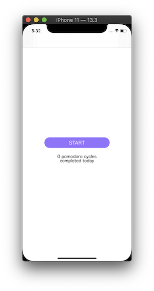

# Mob1.3 Pomodoro Exercise

## About
The purpose of this tutorial is to learn about how to pass data using NotificationCenter in Swift using the [Pomodoro Technique](https://en.wikipedia.org/wiki/Pomodoro_Technique) to improve productivity

### Features
* Home Screen - displays the number of pomodoro cycles completed via NotificationCenter
* Pomodoro Screen - displays the coundown time for each pomodoro cycle and breaks

### App Screenshots
  

### Run Locally

Project code can be viewed locally  and run on Xcode's simulator by downloading/cloning this repo.

## Built With
* [Xcode - 11.3.1](https://developer.apple.com/xcode/) - The IDE used
* [Swift - 5.1.4](https://developer.apple.com/swift/) - Programming Language

